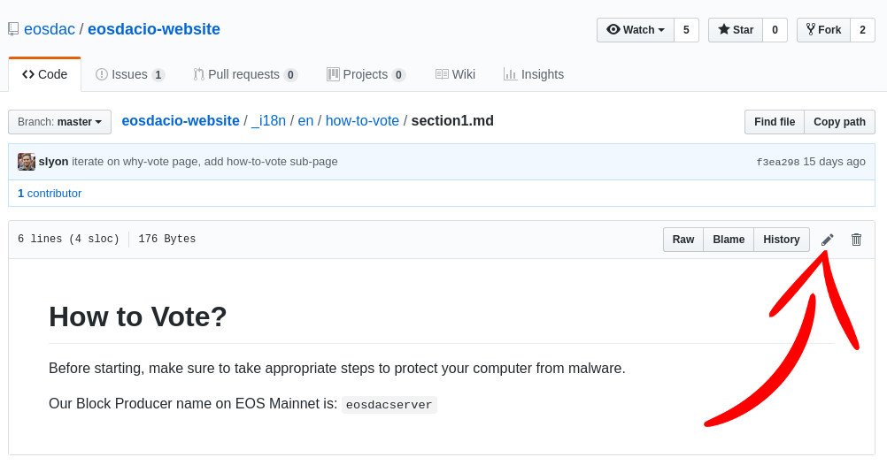

# Quickstart
The website is structured in a way to have the code (HTML/CSS) separated from the content ([Markdown](https://kramdown.gettalong.org/syntax.html)), so that contributors only need to edit easily readable markdown files and not touch any program code.

## Before you start
Before you can edit any code or content of this website, you need to create your copy of this git repository. This can be done by forking the repo into your Github account, via the **"Fork"** button at the top right of the Github Web-UI: <https://help.github.com/articles/fork-a-repo>

This fork/copy of the website is just for you. You can experiment with it, change files, submit git commits – all without the fear of breaking anything on the upstream (original) eosDAC website repository. Once you're happy with your changes, you can submit a pull request from your fork (`origin`) to the original eosDAC website git repository (`upstream`).

## Quickly change a page online
If you want to quickly update a page, find the page and section of your content. Usually they are located in `_i18n/en/PAGE/SECTION.md`, news posts are located in `_i18n/en/_posts/DATE-POST.md`. Assets, such as images, are located in `assets/PAGE/IMAGE.png`. You can also use the search functionality inside the GitHub header menu.

Once you found the relevant section, can use the integrated Github Markdown online-editor to propose a change directly from within the Github Web-UI.

For example if you would like to change the first paragraph/section of the [how-to-vote](https://github.com/eosdac/eosdacio-website/blob/master/_i18n/en/how-to-vote/section1.md) page, you could edit it [directly on Github](https://github.com/eosdac/eosdacio-website/edit/master/_i18n/en/how-to-vote/section1.md):

## Working on the website
If you want to do regular work on the website, like adding pages, changing pages, updating translations, ... you should not do this via the (limited Github Online-Editor), but rather use a real text or [Markdown editor](https://jbt.github.io/markdown-editor/), like [VS Code](https://code.visualstudio.com/) or [Atom](https://atom.io/), and add, remove or modify the files in there. Using a text editor like **VS Code** allows you to use it's full-text search across all website files, so that you can quickly find the content, which you would like to modify: <https://code.visualstudio.com/docs/editor/codebasics#_search-across-files>

You can also watch this Youtube tutorial, showing how to propose a change to this website via the **Github Desktop** client on Windows: <https://www.youtube.com/watch?v=uAlnTSHSMrI>